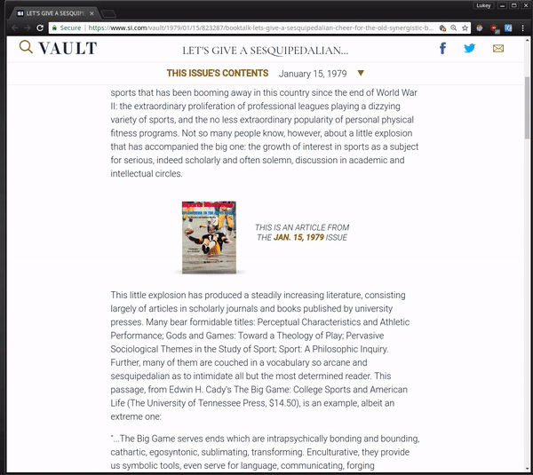

# Dictionary.com-Extension
### Learn new words at the speed of click!
Dictionary.com extension for Google Chrome!

## What is this?
- This is an updated version of one of my long time favorite extensions for Google Chrome.
- The original version released by the Dictionary.com is old and no longer updated, meaning it is not supported by many modern web browsers (as of September 19, 2017).
- The purpose of this project is to update it to Manifest version 2.0, that way I can use it on my Linux desktop at home.
- The current "official" release can be found [here](https://chrome.google.com/webstore/detail/dictionarycom-extension/epkhgmlgiomobdlofllfmoejgjdojknn/reviews), but won't show up if you search for it, because it is too old.

## Installation
- Anyone can install this extension to a compatible version of Google Chrome with the following steps.
### Steps 
- Clone or download this repository.
- In Google Chrome, navigate to "chrome://extensions"
- Make sure the checkbox for "Developer Mode" is checked in the top right.
- Click "Load unpacked extension," then select the `Dictionary_com_extension` folder from wherever you saved it on your computer.
- You are good to go! You can set custom options for definition popup menus, but the coveted right click functionality will work right away.

